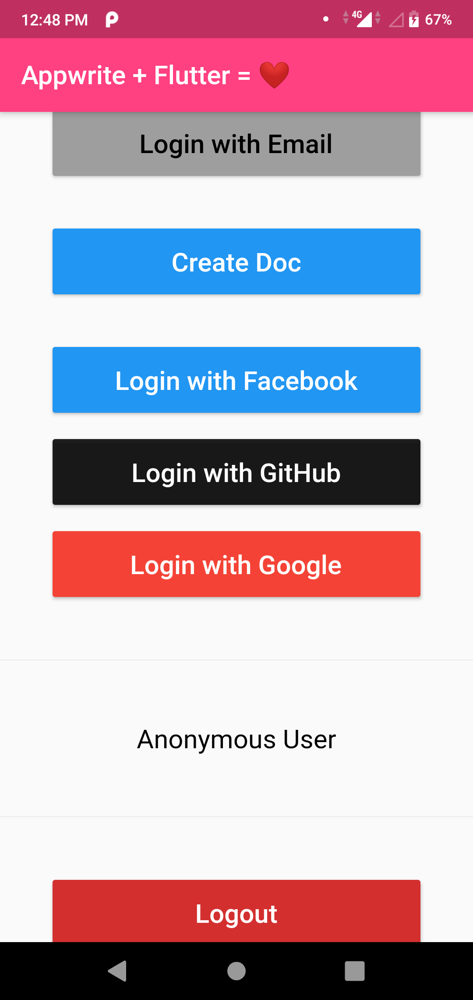

# Appwrite's Flutter Playground 🎮

Appwrite playground is a simple way to explore the Appwrite API & Appwrite Flutter SDK. Use the source code of this page to learn how to use the different Appwrite Flutter SDK features.

This is Appwrite Flutter integration. For Dart server side integration please look at our [Dart Playground](https://github.com/appwrite/playground-for-dart) and [Dart SDK](https://github.com/appwrite/sdk-for-dart)



## Get Started

The `lib/main.dart` file in this repository contains **all** the playground examples and source code.

You can learn how to to integrate your Appwrite Flutter SDK in your project and see how different features of the SDK can be used.

This playground doesn't include any Appwrite best practices but rather intended to show the most simple examples and use cases of using the Appwrite API in your app.

### Setup

We recommend using the [Appwrite CLI](https://appwrite.io/docs/command-line) to setup your Appwrite project.

1. Create a Project in the Appwrite Console with ID `playground-for-flutter`. If you're using a different Project ID, make sure to use the same ID in the following commands, the `appwrite.json`, and `android/app/src/main/AndroidManifest.xml`.

2. Export your project ID as an environment variable (replace with your actual project ID):

   For Windows Command Prompt (cmd):
   ```cmd
   set PROJECT_ID=playground-for-flutter
   ```

   For Windows PowerShell:
   ```powershell
   $env:PROJECT_ID="playground-for-flutter"
   ```

   For Unix / MacOS / Linux:
   ```bash
   export PROJECT_ID=playground-for-flutter
   ```

3. Create a Flutter Platform for each platform you'd like to test:

   For Windows Command Prompt (cmd):
   ```cmd
   appwrite projects create-platform --project-id %PROJECT_ID% --type flutter-ios --name "io.appwrite.playgroundForFlutter" --key "io.appwrite.playgroundForFlutter"
   appwrite projects create-platform --project-id %PROJECT_ID% --type flutter-android --name "io.appwrite.playground_for_flutter" --key "io.appwrite.playground_for_flutter"
   appwrite projects create-platform --project-id %PROJECT_ID% --type flutter-macos --name "io.appwrite.playgroundForFlutter" --key "io.appwrite.playgroundForFlutter"
   appwrite projects create-platform --project-id %PROJECT_ID% --type flutter-windows --name "playground_for_flutter" --key "playground_for_flutter"
   appwrite projects create-platform --project-id %PROJECT_ID% --type flutter-linux --name "playground_for_flutter" --key "playground_for_flutter"
   ```

   For Windows PowerShell:
   ```powershell
   appwrite projects create-platform --project-id $env:PROJECT_ID --type flutter-ios --name "io.appwrite.playgroundForFlutter" --key "io.appwrite.playgroundForFlutter"
   appwrite projects create-platform --project-id $env:PROJECT_ID --type flutter-android --name "io.appwrite.playground_for_flutter" --key "io.appwrite.playground_for_flutter"
   appwrite projects create-platform --project-id $env:PROJECT_ID --type flutter-macos --name "io.appwrite.playgroundForFlutter" --key "io.appwrite.playgroundForFlutter"
   appwrite projects create-platform --project-id $env:PROJECT_ID --type flutter-windows --name "playground_for_flutter" --key "playground_for_flutter"
   appwrite projects create-platform --project-id $env:PROJECT_ID --type flutter-linux --name "playground_for_flutter" --key "playground_for_flutter"
   ```

   For Unix / MacOS / Linux:
   ```bash
   appwrite projects create-platform --project-id $PROJECT_ID --type flutter-ios --name "io.appwrite.playgroundForFlutter" --key "io.appwrite.playgroundForFlutter"
   appwrite projects create-platform --project-id $PROJECT_ID --type flutter-android --name "io.appwrite.playground_for_flutter" --key "io.appwrite.playground_for_flutter"
   appwrite projects create-platform --project-id $PROJECT_ID --type flutter-macos --name "io.appwrite.playgroundForFlutter" --key "io.appwrite.playgroundForFlutter"
   appwrite projects create-platform --project-id $PROJECT_ID --type flutter-windows --name "playground_for_flutter" --key "playground_for_flutter"
   appwrite projects create-platform --project-id $PROJECT_ID --type flutter-linux --name "playground_for_flutter" --key "playground_for_flutter"
   ```

4. Use the Appwrite CLI to deploy the Database and Collection:

   ```bash
   appwrite deploy collection --all --yes
   ```

5. Use the Appwrite CLI to deploy the Bucket:

   ```bash
   appwrite deploy bucket --all --yes
   ```

6. Use the Appwrite CLI to create the test user:

   ```bash
   appwrite users create --user-id "unique()" --email "user@appwrite.io" --password "password" --name "Test User"
   ```

7. Create `lib/constants.dart` using `lib/constants.dart.default` as a template:

   ```bash
   cp lib/constants.dart.default lib/constants.dart
   ```

8. Run the app:

   ```bash
   flutter run lib/main.dart
   ```

## Contributing

All code contributions - including those of people having commit access - must go through a pull request and approved by a core developer before being merged. This is to ensure proper review of all the code.

We truly ❤️ pull requests! If you wish to help, you can learn more about how you can contribute to this project in the [contribution guide](https://github.com/appwrite/appwrite/blob/master/CONTRIBUTING.md).

## Security

For security issues, kindly email us [security@appwrite.io](mailto:security@appwrite.io) instead of posting a public issue in GitHub.

## Follow Us

Join our growing community around the world! Follow us on [Twitter](https://twitter.com/appwrite), [Facebook Page](https://www.facebook.com/appwrite.io), [Facebook Group](https://www.facebook.com/groups/appwrite.developers/) or join our [Discord Server](https://appwrite.io/discord) for more help, ideas and discussions.
